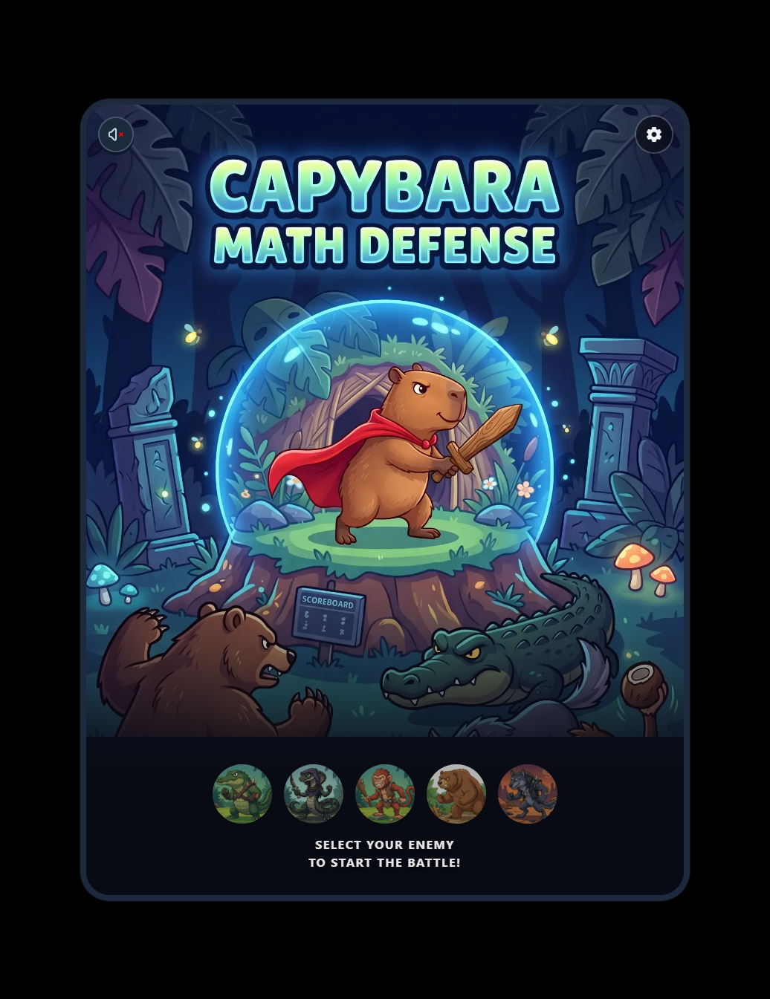
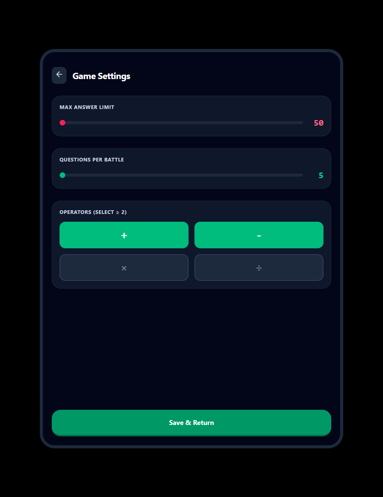
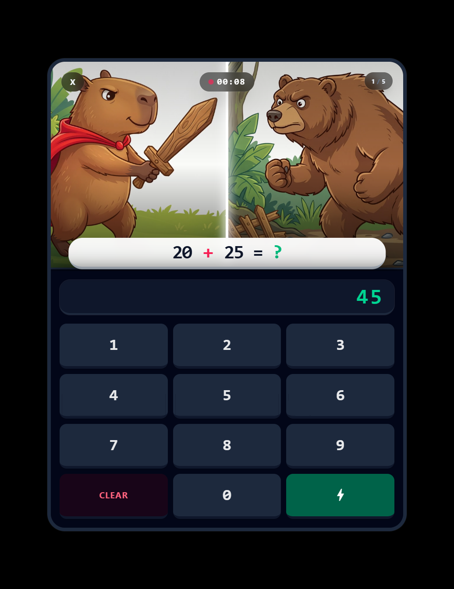
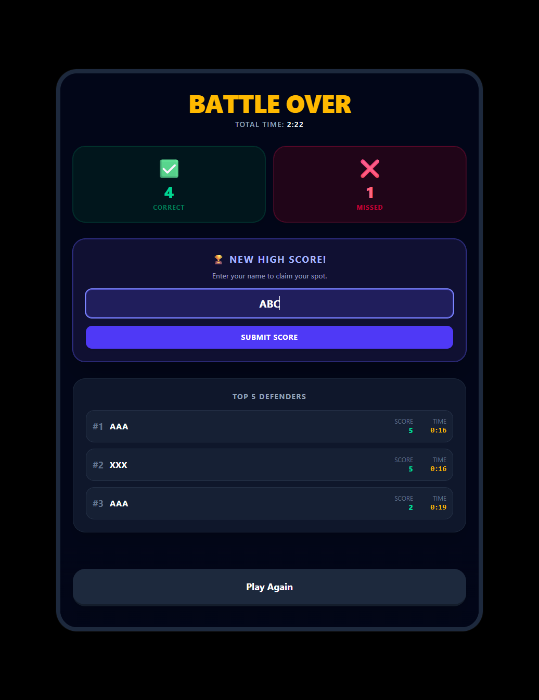

# 🧮 Capybara Math Guard


An offline, mobile-first educational math game designed for kids ages 8 to 10. Help a brave Capybara defend its home by solving fast-paced arithmetic problems!

---

## 📸 Sneak Peek

<p align="center">
  
  
  
  
</p>

### 🎬 Gameplay Demo

<p align="center">
  <video src="Capybara-Math-Defense-audio.mp4" width="600" controls="controls"></video>
</p>

---

## 🎯 Purpose
The goal of **Capybara Math Defense** is to make math practice engaging and rewarding for young learners. As my kid is getting bored at home during school break right now and wanted to improve her maths, created an RPG-style battle game where their quick thinking and math skills directly power the hero's attacks. Built as a 100% offline standalone Web App and port over to native Android app, it's a safe, ad-free environment for kids to learn.

## ⚔️ How the Game Works
1. **Choose Your Foe:** The game starts on a vibrant splash screen where the player selects one of 5 enemy animals to battle.
2. **The Battle Arena:** The screen splits into two halves. The top half displays the animated battle between the Capybara and the enemy, while the bottom half contains a kid-friendly numeric keypad.
3. **Math Combat:** The enemy "spits out" a math question. 
   - **Correct Answer:** The Capybara charges forward and performs a sword magic attack! 
   - **Incorrect Answer:** The enemy strikes the Capybara.
4. **The Scoreboard:** The battle ends when all questions are answered. If the player is fast enough and gets enough correct answers, they can enter their name (up to 10 characters) into the persistent Top 5 Offline Leaderboard.

## 🎭 The Cast
* **The Hero:** 🗡️ A cute, brave Capybara wearing a red cape and wielding a wooden sword.
* **The Invaders (Enemies):**
  1. 🐊 Grumpy Crocodile
  2. 🐍 Sneaky Snake
  3. 🐒 Mischievous Monkey
  4. 🐻 Growling Bear
  5. 🐺 Prowling Wolf

## ⚙️ Settings Available
Parents or kids can easily tailor the difficulty of the game via the Settings gear icon on the splash screen.
* **Answer Limit:** Cap the maximum possible answer to either **100** or **1000**.
* **Operators:** Toggle specific math operators on or off (`+`, `-`, `*`, `÷`). At least two must be selected.
* **Battle Length:** Adjust the number of questions per battle round, ranging from **50 to 500**.

---

## 🛠️ Tech Stack & Assets
* **Frontend Framework:** Angular v21 (Standalone Components, Signals, new Control Flow).
* **Styling:** Tailwind CSS (Dark-mode optimized UI).
* **Mobile Porting:** Capacitor (to compile the web app into a native Android APK).
* **AI Asset Generation:**
  * **Images & Characters:** Generated using **zImage turbo**.
  * **Battle Animations:** Video sequences generated using **LTX2.3 in ComfyUI**, with metadata stripped for peak mobile performance.
* **Storage:** LocalStorage (Offline persistence for settings and high scores).

---

## 🚀 How to Run the Game

### Run Locally in Browser
1. Clone the repository:
   ```bash
   git clone https://github.com/dumenu8/capybara-math-defense.git
   cd capybara-math-defense
2. Install dependencies:
	```bash
   npm install
3. Start the local development server:
	```bash
   npx ng serve
4. Open your browser and navigate to http://localhost:4200. (Tip: Use Chrome DevTools to emulate a mobile portrait view for the best experience!)

### Run on Android (Via Android Studio)
To play the game natively on your Android phone or tablet:

1. Ensure you have Android Studio installed.

2. Build the Angular production app:
   ```bash
   npm run build
3. Sync the web assets to the Capacitor Android project:
   ```bash
   npx cap sync android
4. Open the project in Android Studio:
   ```bash
   npx cap open android
5. Connect your phone or tablet via USB (ensure USB Debugging is enabled), or select an emulator, and click the Run (▶) button in Android Studio.

### Enjoy the game and happy calculating! 🧮🦦
